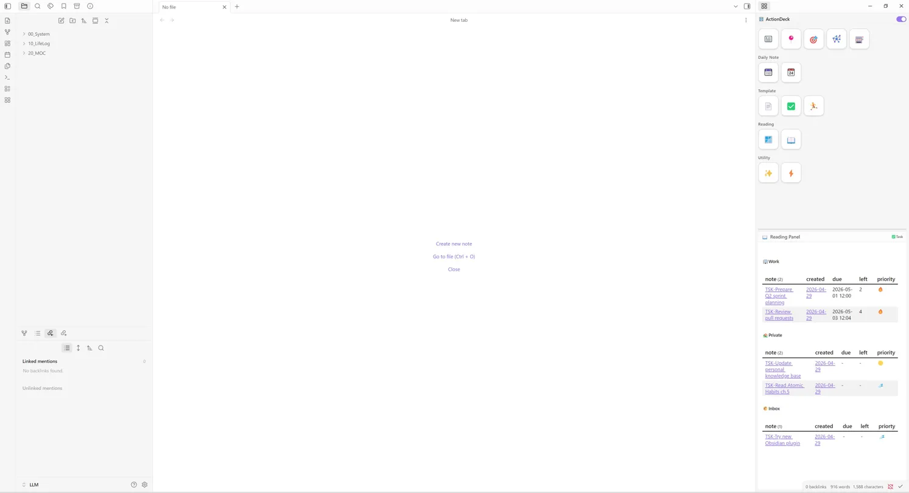
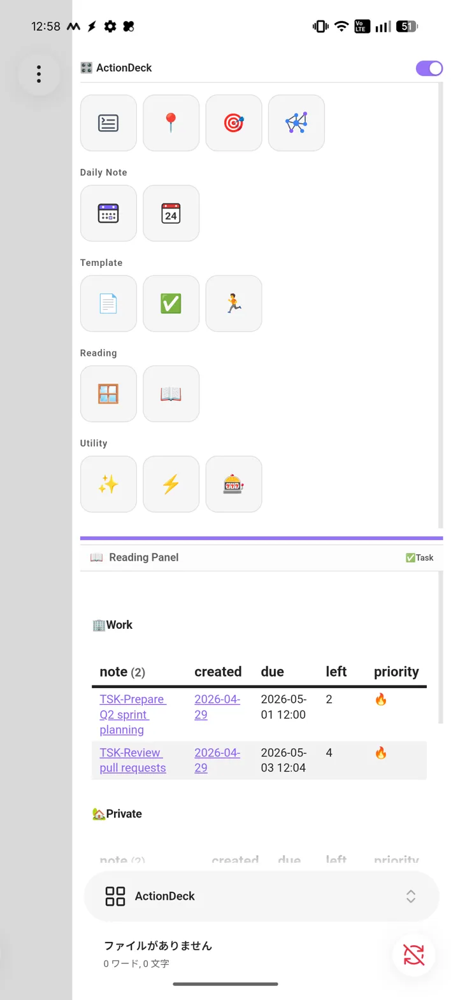

# ActionDeck

A customizable sidebar launcher for [Obsidian](https://obsidian.md) that lets you run any command with a single click.

Organize your most-used commands into a tidy panel on the right sidebar — no more digging through the command palette.

|          Desktop View          |            Mobile View             |
| :----------------------------: | :--------------------------------: |
|  |  |

*Note: Screenshots show an upcoming version featuring the Reading Panel.*

---

## Why ActionDeck?

Most Obsidian workflows assume a keyboard-first environment.
ActionDeck was built for users who prefer GUI-driven interaction — 
especially on mobile, where command palettes and shortcuts 
create unnecessary friction.

Born from a personal need to reduce cognitive load, 
ActionDeck turns any Obsidian command into a single tap.

---

## Features

- **One-click command execution** — assign any Obsidian command to a button
- **Flexible icon types** — Emoji, [Lucide](https://lucide.dev/) icons, Vault images, external image URLs, or raw SVG code
- **Group organization** — arrange buttons into named groups with custom ordering
- **Deletion history** — accidentally deleted a button or group? Restore it with one click
- **Multilingual UI** — English and Japanese supported out of the box (auto-detected from Obsidian's language setting)

---

## Installation

### From the Community Plugins browser (recommended)

1. Open **Settings → Community plugins**
2. Click **Browse** and search for `ActionDeck`
3. Click **Install**, then **Enable**

### Manual installation

1. Download `main.js`, `manifest.json`, and `styles.css` from the [latest release](https://github.com/tashihiki/action-deck/releases)
2. Copy all three files into your vault at `.obsidian/plugins/action-deck/`
3. Reload Obsidian and enable the plugin under **Settings → Community plugins**

---

## Usage

### Opening the panel

- The **ActionDeck** panel opens automatically in the right sidebar on startup
- Click the grid icon (⊞) in the ribbon to reopen it at any time
- Or run the command **"ActionDeck: Open launcher panel"** from the command palette

### Adding a button

1. Go to **Settings → ActionDeck**
2. Scroll to **Launcher Buttons** and click **＋ Add Button**
3. Choose an icon type, enter the icon content, set a label, and paste a Command ID
4. The button appears in the sidebar immediately — no save or reload needed

### Finding a Command ID

You don't need to memorize Command IDs. In **Settings → ActionDeck**, simply start typing the name of the command in the Command ID field. The autocomplete feature will help you find and select the correct ID.

### Grouping buttons

1. Go to **Settings → ActionDeck → Launcher Groups**
2. Add one or more group names
3. Edit each button's **Group** dropdown to assign it to a group

---

## Settings

| Setting                | Description                                                |
| ---------------------- | ---------------------------------------------------------- |
| **Launcher icon size** | Font size (px) for all button icons. Default: `22`         |
| **Launcher Groups**    | Define and reorder named groups for organizing buttons     |
| **Launcher Buttons**   | Add, edit, reorder, and delete individual launcher buttons |

### Button options

| Option           | Description                                                          |
| ---------------- | -------------------------------------------------------------------- |
| **Icon Type**    | `Text / Emoji`, `Lucide`, `Image (Vault)`, `Image (URL)`, `SVG Code` |
| **Icon Content** | The emoji, icon name, file path, URL, or SVG markup                  |
| **Label**        | Tooltip text shown on hover                                          |
| **Group**        | The group this button belongs to (optional)                          |
| **Icon Color**   | CSS color value for the icon                                         |
| **Command ID**   | The Obsidian command to execute (autocomplete supported)             |

---

## Roadmap

- [x] Basic launcher functionality and icon customization
- [x] Group organization and deletion history
- [ ] **Reading Panel integration** (Shown in screenshots)
- [ ] **Advanced Settings Dashboard** (Centralized UI for managing modules)
- [ ] **Automation & Triggers** (Event-driven action execution)
- [ ] **Action Deck Utilities** (Execute specific workflows managed within the plugin)

---

## Contributing

Bug reports and feature requests are welcome via [GitHub Issues](https://github.com/tashihiki/action-deck/issues).

Pull requests are also appreciated — please open an issue first to discuss larger changes.

---

## License

[MIT](LICENSE)
